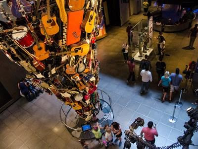
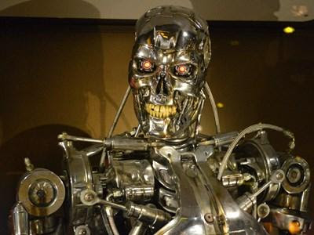
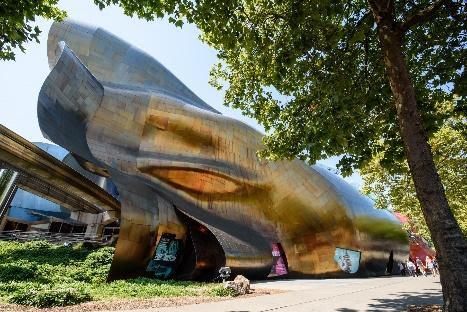

| July 10 | [**Tutorials**](/program/tutorials/) and [**Affinity Group Workshops**](/program/affinity/)
| July 11--13 | [**Main Conference**](/program/schedule/) (Main Conference Papers, Industry Track, System Demonstrations, Student Research Workshop) |
| July 14--15 | [**Workshops**](/program/workshops/) |

Other events: [**Structured Socials**](/blog/welcome-to-structured-socials/), [**Birds-of-a-Feather Meetups**](/blog/welcome-to-bofs/)

## Conference Handbook

The conference handbook can be downloaded [here](/downloads/handbook.pdf).

## Welcome Reception

A Welcome Reception will be held on **Sunday, July 10** from 6:00pm to 8:00pm. Join us at the
conference venue where you can meet and make new friends and catch up with your colleagues. Light
food and refreshments will be served.

## Social Event

The NAACL 2022 Social Event will be held on **Tuesday, July 12** from 7:00 pm to 10:00 pm at the
Museum of Pop Culture (MoPOP). Housed in a building designed by architect Frank Gehry, this
museum features rotating exhibits dedicated to all things pop culture, including film, music, comic
books, and more. MoPOP’s permanent collection features more than 80,000 objects. While we add
objects to this online catalog over the coming years until the entire collection is accessible digitally,

MoPOP curators have selected iconic objects from across genres and time periods, in order to highlight
the breadth of MoPOP’s permanent collection. Visit [here](https://www.mopop.org/collection/highlights/) to learn more about MoPOP.

The Museum of Pop Culture (formerly EMP Museum) is located at 325 5th Avenue N at Seattle Center.

One entrance ticket will be included with your in-person registration. Please note that we need to plan
ahead so it is important to let us know on the registration form whether or not you plan to attend the
social event.

## Meals

A light Breakfast will be provided daily and can be found on levels 3 & 5 pre-function.

Breaks --- Tea, coffee, pastries and snacks will be provided early morning, mid-morning and mid-afternoon and will be found in the Regency Ballroom on level 7 (on Sunday the location will be level 3 pre-function).

Lunch is not provided, but there are plenty of cafes, restaurants and shops near by within walking distance as well as the hotel has a grab and go market open until 14:00.

Dinner will only be provided during the Welcome Reception on Sunday evening (starting at 18:30) located on Level 5 pre-function and Tuesday evening at the social event at MoPop.

## Special rooms

Some of the hotel rooms are dedicated to certain functions for the entire time of the conference:

- Quiet Room (703 Hoko)
- Prayer Room (704 Newaukum)
- Childcare (305 Chalais)
- Nursing station (304 Calawah)
- During the main conference (Monday July 11 – Wednesday July 13), the D&I birds of a feather sessions will take place in 502 Cowlitz and 506 Samish.
